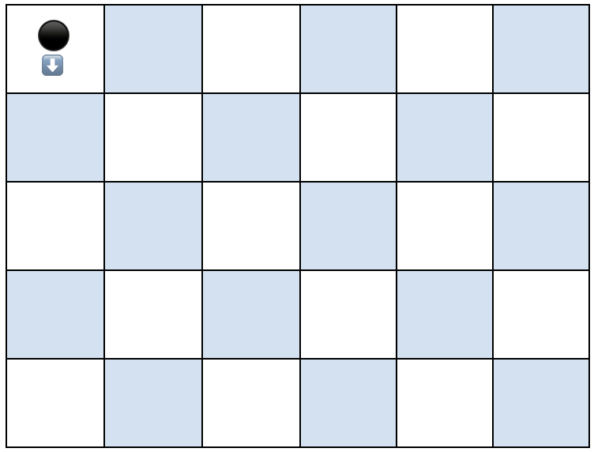

# Roomba
Quick casual python script to simulate runs in the teleporting roomba problem, below:

## Command line arguments:

    --help, -h: display help
    --draw, -d: draw the simulation in the terminal window
    --speed, -s [int]: set drawing refresh rate in ms
    --log, -l: turn on logging to trials.txt
    --runs, -r [int]: set number of runs to perform
    --dimensions, -dim [rows] [columns]: set the size of the floor to be cleaned

## The problem:

You own a roomba—let’s name him James—and want him to clean the entirety of your apartment, which is one 5’x6’ room (you live in NYC). You put James in the Northwest corner of your apartment, and position him facing South. When James is pointing in one direction, he will keep moving in that direction, vacuuming 1 square foot at a time, until he hits a wall. He vacuums squares at a pace of 1 square foot per second. 

James is very smart and can keep track of which spots he’s already vacuumed, so when he hits a wall he can teleport immediately to any unvacuumed square. But he’s also very dumb, and chooses this square randomly from all remaining unvacuumed squares, and chooses his new direction—North, East, South, or West—randomly as well. When James teleports to a new square, he first vacuums that square (whether or not it is already vacuumed), which takes 1 second, and then moves in the (randomly determined) direction he’s facing and proceeds to vacuum the next square (whether or not it is already vacuumed) et cetera until he again hits a wall.

What is the minimum number of seconds it could take him to vacuum your apartment?
[Your answer here]

What is the maximum number of seconds it could take him to vacuum your apartment?
[Your answer here]

Call the expected number of seconds it will take him to vacuum your apartment X (that is, if you average the number of seconds it takes him across infinite independent trials, you get X). Please give a 90% confidence interval on the value of X (i.e., a range such that you think X is 90% to fall within that range, and 10% to not fall within that range). You are welcome but not required to show your work. 
[Your answer here]
